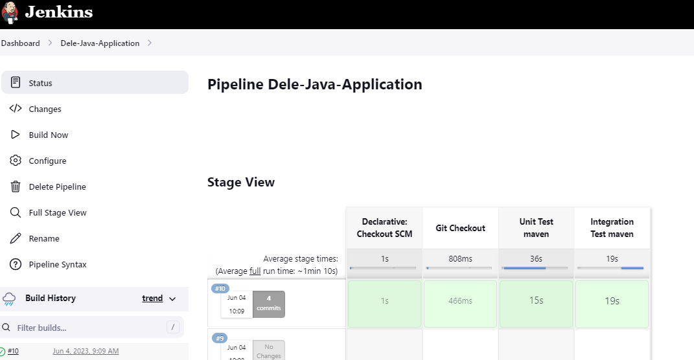
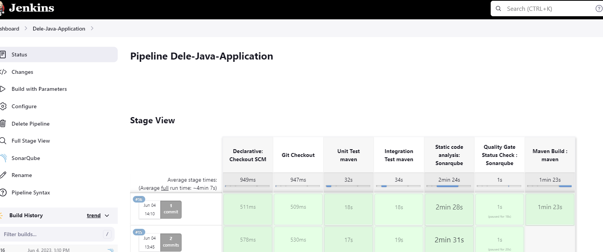
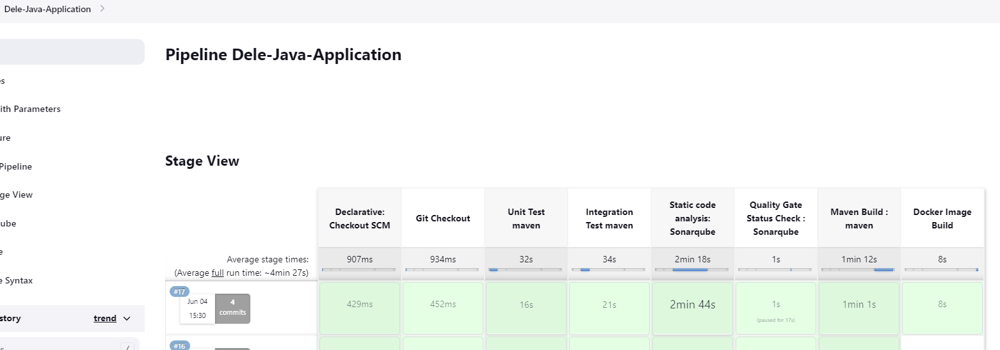
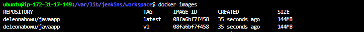
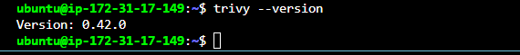
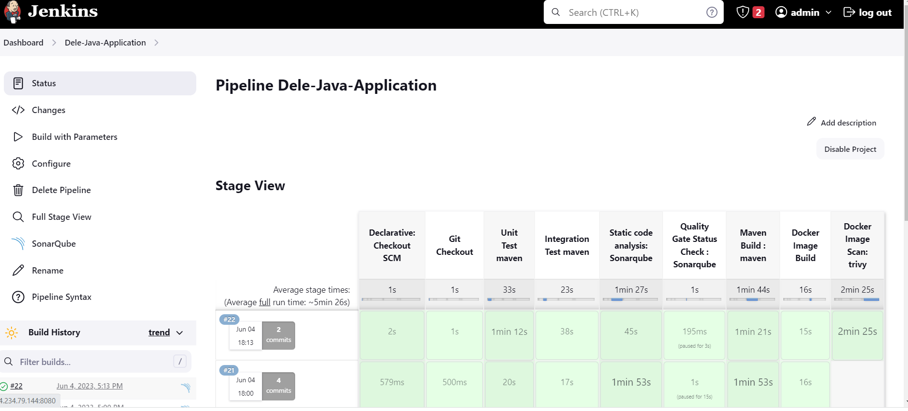
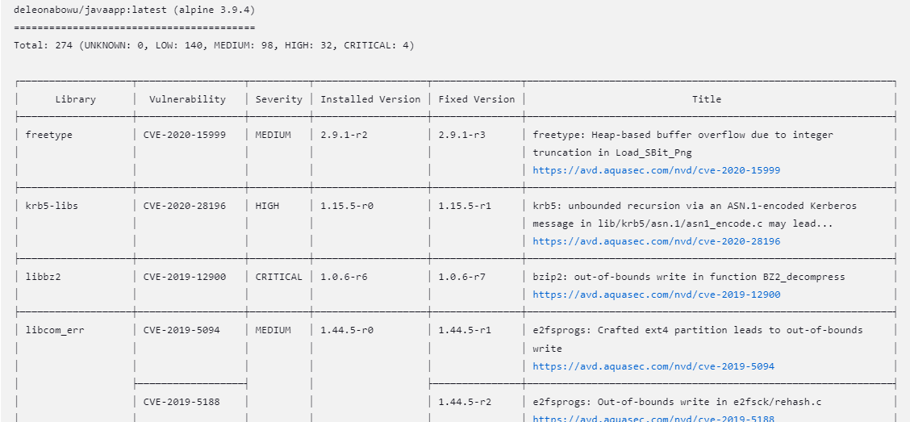

We shall be building a CI/CD Pipeline to deploy our java application in a Kubernetes cluster. We shall be using Jenkins shared library instead of a simple Jenkinsfile. 

 - We shall host our Jenkins shared Library as well as our application code in Github
 - Jenkins will checkout the code from Github
 - Jenkins will do Unit Testing, Integration Testing and Static Code Analysis using Sonarqube
 - Next it will do a Quality Gate status checks
 - If it passes, It will proceed with the build otherwise it will be marked as failed.
 -  The Maven build will produce a*.jar artifact.
 -  We shall use a Dockerfile to build our docker image
 -  Next, we shall scan our image for vulnerabilities using Trivy. If pushing to ECS, we can enable image scanning i.e push on scan feature. 
 -  We shall push our image to dockerhub or ECS.
 -  The image pushed to the repo will be used in our deployment manifests to deploy into our Kubernetes cluster.


CREATE JENKINS SERVER
- create VPC with 2 private and 2 public subnets (cicd-project-vpc)  vpc-094dc7f7668457ea8
-	Use Ubuntu image 22.04
-	Choose T2 Medium
-	Create Key Pair   (cicd-keypair)
-	Security group 
	Open Port 22 (SSH), 8080(Jenkins) and 9000(SonarQube)
-	Storage 30GB
 
Userdata
Install Jenkins, Docker and Sonarqube
The docker is needed to run sonarqube as a container
i.e docker run -d --name sonarqube -p 9000:9000 -p 9092:9092 sonarqube
```

#!/bin/bash

sudo apt update -y

sudo apt upgrade -y 

sudo apt install openjdk-17-jre -y

curl -fsSL https://pkg.jenkins.io/debian-stable/jenkins.io-2023.key | sudo tee \
  /usr/share/keyrings/jenkins-keyring.asc > /dev/null
echo deb [signed-by=/usr/share/keyrings/jenkins-keyring.asc] \
  https://pkg.jenkins.io/debian-stable binary/ | sudo tee \
  /etc/apt/sources.list.d/jenkins.list > /dev/null
sudo apt-get update -y 
sudo apt-get install jenkins -y

```
INSTALL DOCKER

```
#!/bin/bash
sudo apt update -y

sudo apt install apt-transport-https ca-certificates curl software-properties-common -y

curl -fsSL https://download.docker.com/linux/ubuntu/gpg | sudo apt-key add -

sudo add-apt-repository "deb [arch=amd64] https://download.docker.com/linux/ubuntu bionic stable" -y

sudo apt update -y

apt-cache policy docker-ce -y

sudo apt install docker-ce -y

#sudo systemctl status docker
### This added to ensure our container runs
sudo chmod 777 /var/run/docker.sock

```

Launch Sonarqube container
```
docker run -d --name sonarqube -p 9000:9000 -p 9092:9092 sonarqube
```

Wait for our instance to be up and running.

Go to Jenkins using the Instance public IP on port 8080

Get the InitialAdminPassword and log into the Jenkins web interface


 Check if docker was successfully installed by running
```
 docker container ls
```


- Sonarqube container is running


Create our first jenkins job as a pipeline, pipeline script from SCM, script path as Jenkinsfile


We shall be using 2 git repositories

1. Host our java app, jenkinsfile,dockerfile and deployment manifest files
https://github.com/deleonab/cicd-java-app.git

2. Host our jenkins shared library

https://github.com/deleonab/jenkins-shared-library-for-pipeline.git

We shall import the jenkins shared library into our jenkinsfile and pass parameters into our script. This way, different teams could use the same library.

jenkins-shared-library-for-pipeline/vars/
The vars directory will contain all the groovy scripts which will be called into our Jenkinsfile

Repo: jenkins-shared-library-for-pipeline
folder: vars
file: gitCheckout.groovy

```
def call(Map stageParams) {
 
    checkout([
        $class: 'GitSCM',
        branches: [[name:  stageParams.branch ]],
        userRemoteConfigs: [[ url: stageParams.url ]]
    ])
  }
```

Repo: cicd-java-app
file: Jenkinsfile

import the library into our Jenkinsfile @Library('my-shared-library') _
```
@Library('my-shared-library') _

pipeline{

    agent any

       stage('Git Checkout'){
                    
            steps{
            gitCheckout(
                branch: "main",
                url: "https://github.com/deleonab/cicd-java-app.git"
            )
            }
        }
}
```
Get the url for our git jenkins shared library
```
https://github.com/deleonab/jenkins-shared-library-for-pipeline.git
```
Go to Jenkins
Dashboard > Manage Jenjins > System Configuration > System

Search for the 'Global Pipeline Libraries' section

Name: my-shared-library
Default Version: main
Project Repository: https://github.com/deleonab/jenkins-shared-library-for-pipeline.git


 Let's build our pipeline that contains just the git checkout stage > Build Now


 Build was successful

 All other stages will be using the same method of using theimportes jenkins library and supplying the values.

The next stage is to carry out our Unit Test

Repo: jenkins-shared-library-for-pipeline
folder: vars
file: mvnTest.groovy
```
def call(){
    sh 'mvn test'
}
```
Repo: cicd-java-app
file: Jenkinsfile

```
stage('Unit Test maven'){
         
         
            steps{
               script{
                   
                   mvnTest()
               }
            }
        }
        
```

Jekinsfile now has two stages (Build and Unit Test)

```
@Library('my-shared-library') _
pipeline{

    agent any
stages{
       stage('Git Checkout'){
                    
            steps{
            gitCheckout(
                branch: "main",
                url: "https://github.com/deleonab/cicd-java-app.git"
            )
            }
        }

        stage('Unit Test maven'){
         
         
            steps{
               script{
                   
                   mvnTest()
               }
            }
        }
}
}
```

We shall run the build now. It should fail as Maven hasn't been configured for our pipeline yet

```
Build now
```


It has failed as expected.

We shall now install maven on our jenkins server

```
sudo apt update -y

sudo apt install maven -y
mvn -version

```
```
 systemctl restart user@1000.service

No user sessions are running outdated binaries.

No VM guests are running outdated hypervisor (qemu) binaries on this host.
Apache Maven 3.6.3
Maven home: /usr/share/maven
Java version: 17.0.7, vendor: Private Build, runtime: /usr/lib/jvm/java-17-openjdk-amd64
Default locale: en, platform encoding: UTF-8
OS name: "linux", version: "5.19.0-1025-aws", arch: "amd64", family: "unix"
```

Let's build the Unit Test Stage > Build Now

Result: Failure: Failed to execute goal

excerpt from Console Output
```
Fatal error compiling: java.lang.ExceptionInInitializerError: Unable to make field private com.sun.tools.javac.processing.JavacProcessingEnvironment$DiscoveredProcessors
```

Solution: I updated the lombok version from 1.18.8 to 1.18.28 in pom.xml of our Java application

Let's build the Unit Test Stage > Build Now

Result: Success


The next stage is to do the Maven Integration Testing

Repo: jenkins-shared-library-for-pipeline
folder: vars

```
def call(){
    sh 'mvn test'
}
```
Repo: cicd-java-app
file: Jenkinsfile

```
stage('Integration Test maven'){
         when { expression {  params.action == 'create' } }
            steps{
               script{
                   
                   mvnIntegrationTest()
               }
            }
        }
```

The current Jenkinsfile is as below:

```
@Library('my-shared-library') _
pipeline{

    agent any
stages{
       stage('Git Checkout'){
                    
            steps{
            gitCheckout(
                branch: "main",
                url: "https://github.com/deleonab/cicd-java-app.git"
            )
            }
        }

        stage('Unit Test maven'){
         
         
            steps{
               script{
                   
                   mvnTest()
               }
            }
        }

        
        stage('Integration Test maven'){
         
            steps{
               script{
                   
                   mvnIntegrationTest()
               }
            }
        }

}
}

```

Let's build stages 1- 3 (checkout,unit test, integration test)



Build successful


Let's add conditions to out pipeline so that stages would only run when some conditions are true

Wwe shall define the parameters in our Jenkinsfile

```
parameters{

   choice(name: 'action', choices: 'create\ndelete', description: 'Choose create/destroy')

}
```
.. and use in a when expression for the stages
```
when {expression { param.action == 'create'}}
```
Our Jenkinsfile now looks like this

```
@Library('my-shared-library') _
pipeline{

    agent any

 parameters{

        choice(name: 'action', choices: 'create\ndelete', description: 'Choose create/Destroy')
       
    }

stages{
       stage('Git Checkout'){
                  when { expression {  params.action == 'create' } }  
            steps{
            gitCheckout(
                branch: "main",
                url: "https://github.com/deleonab/cicd-java-app.git"
            )
            }
        }

        stage('Unit Test maven'){
         when { expression {  params.action == 'create' } }
         
            steps{
               script{
                   
                   mvnTest()
               }
            }
        }

        
        stage('Integration Test maven'){
          when { expression {  params.action == 'create' } }
            steps{
               script{
                   
                   mvnIntegrationTest()
               }
            }
        }

}
}

```


The next stage is to do static code analysis using Sonarqube
It will check the code coverage

We need to configure Jenkins to use Sonarqube
Let us install the Sonarqube plugins required

Manage Jenkins > Plugins > Available plugins


manage jenkins > system cofiguraition > system

- check environment variable checkbox
- name : sonar-api (anything you want)
-server url: http://54.234.79.144:9000    (sonaqube url)

Save configuration and return to enter authentication token


Let us create the sonarqube token

Log into Sonarqube
administration > Security 
Name: jenkins
Type: User
Expires In: 30 Days


Manage Jenkins > Credentials > system

Enter the sonarqube token in the secret field
Kind: Secret text
ID: sonar-api
Description: sonar api


Now we shall add the static code analysis stages to our jenkinsfile

Repo: jenkins-shared-library-for-pipeline
folder: vars
file: staticCodeAnalysis.groovy
```
def call(credentialsId){

    withSonarQubeEnv(credentialsId: credentialsId) {
         sh 'mvn clean package sonar:sonar'
    }
}

```
Repo: cicd-java-app
file: Jenkinsfile
```
stage('Static code analysis: Sonarqube'){
         when { expression {  params.action == 'create' } }
            steps{
               script{
                   
                   def SonarQubecredentialsId = 'sonar-api'
                   statiCodeAnalysis(SonarQubecredentialsId)
               }
            }
        }
```


```
Build Now
```


Next is our Quality Gate status check

```

def call(credentialsId){

waitForQualityGate abortPipeline: false, credentialsId: credentialsId

}
```

```
stage('Quality Gate Status Check : Sonarqube'){
         when { expression {  params.action == 'create' } }
            steps{
               script{
                   
                   def SonarQubecredentialsId = 'sonar-api'
                   QualityGateStatus(SonarQubecredentialsId)
               }
            }
        }
       
```      

Build Now


This stage will remain in a pending stage as it requires a webhook from sonarqube

I ran a build without this and it remained in a pending and paused state for almost 17 minutes until I aborted the build


Let's go to Sonarqube to configure the webhook

Administration > Configuration > webhooks


Let's run our Jenkins build again


We have completed our tests and can now build our application.


Repo: jenkins-shared-library-for-pipeline
folder: vars
file: mvnBuild.groovy
```
def call(){
    sh 'mvn clean install'
}
```
Repo: cicd-java-app
file: Jenkinsfile
```
stage('Maven Build : maven'){
         when { expression {  params.action == 'create' } }
            steps{
               script{
                   
                   mvnBuild()
               }
            }
        }
```

Now we will run the build 



Build was successful

Our workspace is: /var/lib/jenkins/workspace/Dele-Java-Application

Our artifact/*.jar  will be in /target/

The next stage is to write our Dockerfile that would build our container image using the *.jar file

Here is the code for our Dockerfile
```
FROM openjdk:8-jdk-alpine
WORKDIR /app
COPY ./target/*.jar /app.jar
CMD ["java", "-jar", "app.jar"]
```

We will now add our docker build stage to the Jenkins pipeline


Repo: jenkins-shared-library-for-pipeline
folder: vars
file: dockerBuild.groovy
```
def call(String project, String ImageTag, String hubUser){
    
    sh """
      docker image build -t ${hubUser}/${project} . 
      docker image tag ${hubUser}/${project} ${hubUser}/${project}:${ImageTag}
      docker image tag ${hubUser}/${project} ${hubUser}/${project}:latest
     """
 }


 ```

Repo: cicd-java-app
file: Jenkinsfile
 ```
 stage('Docker Image Build'){
         when { expression {  params.action == 'create' } }
            steps{
               script{
                   
                   dockerBuild("${params.ImageName}","${params.ImageTag}","${params.DockerHubUser}")
               }
            }
        }
  ```

We shall add parameters for the image name, image tag and dockerhub user to our Jenkinsfile
This way, we can pass in default values
```
parameters{

        choice(name: 'action', choices: 'create\ndelete', description: 'Choose create/Destroy')
        string(name: 'ImageName', description: "name of the docker build", defaultValue: 'javaapp')
        string(name: 'ImageTag', description: "tag of the docker build", defaultValue: 'v1')
        string(name: 'DockerHubUser', description: "name of the Application", defaultValue: 'deleonabowu')
    }
```

Let's run the pipeline build with the docker build stage



Let's verify that our image has been built by going into out workspace

```
docker images
```


Images were successfully built

Before we push our image to Docker Hub, we need to scan it for bugs and vulnerabilities.
We shall be using Trivy for this purpose.

We need to install trivy on our Jenkins server

```
sudo vi trivy.sh
```
paste the code below into the file and save
```
sudo apt-get install wget apt-transport-https gnupg lsb-release
wget -qO - https://aquasecurity.github.io/trivy-repo/deb/public.key | sudo apt-key add -
echo deb https://aquasecurity.github.io/trivy-repo/deb $(lsb_release -sc) main | sudo tee -a /etc/apt/sources.list.d/trivy.list
sudo apt-get update
sudo apt-get install trivy
```
Install Trivy
```
sh trivy.sh
```
Check installation by running trivy --version

```
trivy --version
```


Add the docker scan stage to the Jenkinsfile

```
stage('Docker Image Scan: trivy '){
         when { expression {  params.action == 'create' } }
            steps{
               script{
                   
                   dockerImageScan("${params.ImageName}","${params.ImageTag}","${params.DockerHubUser}")
               }
            }
        }
```

Let's run the Pipeline build



Trivy scan completed successfully

274 vulnerabilities found




Now that our image has been built and scanned, we need to push the image to our image repository (docker hub)

We need to do a docker clean up after push as we wouldn't need the image anymore

Repo: jenkins-shared-library-for-pipeline
folder: vars
file: dockerImagePush.groovy

```
 def call(String projectImage, String ImageTag, String hubUser){
     withCredentials([usernamePassword(
            credentialsId: "docker",
            usernameVariable: "USER",
            passwordVariable: "PASS"
    )]) {
        sh "docker login -u '$USER' -p '$PASS'"
    }
    sh "docker image push ${hubUser}/${projectImage}:${ImageTag}"
    sh "docker image push ${hubUser}/${projectImage}:latest"   
 }

```

Repo: cicd-java-app
file: Jenkinsfile

```
 stage('Docker Image Push : DockerHub '){
         when { expression {  params.action == 'create' } }
            steps{
               script{
                   
                   dockerImagePush("${params.ImageName}","${params.ImageTag}","${params.DockerHubUser}")
               }
            }
        } 

```


